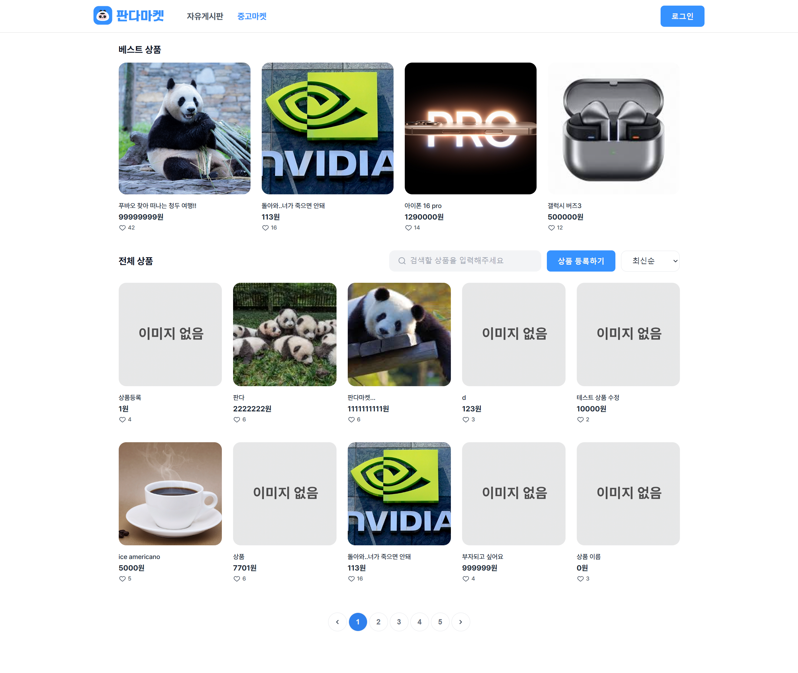
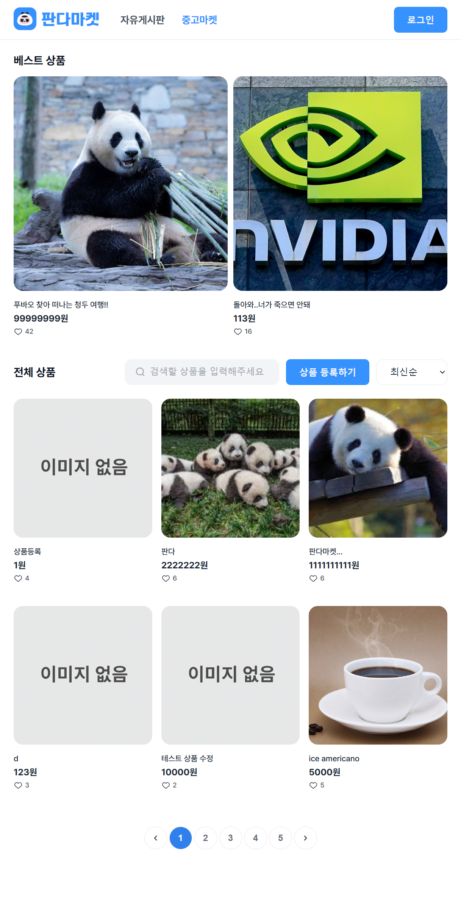
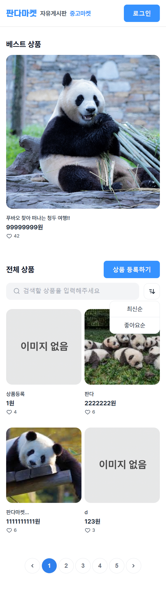
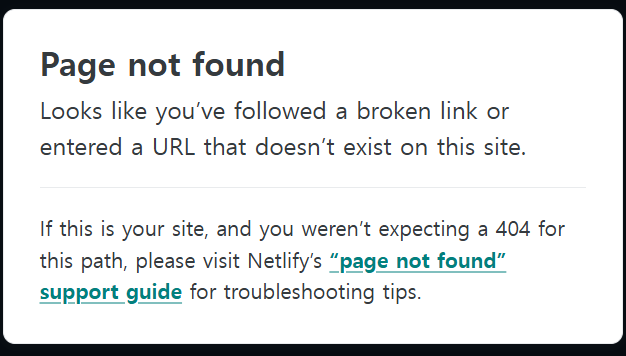

## 요구사항

### 기본

**🐼 중고마켓**

- [x] 중고마켓 페이지 주소는 “/items” 입니다.
- [x] 페이지 주소가 “/items” 일때 상단네비게이션바의 '중고마켓' 버튼의 색상은 “3692FF”입니다.
- [x] 상단 네비게이션 바는 이전 미션에서 구현한 랜딩 페이지와 동일한 스타일로 만들어 주세요.
- [x] 상품 데이터 정보는 https://panda-market-api.vercel.app/docs/#/ 에 명세된 GET 메소드 “/products” 를 사용해주세요.
- [x] '상품 등록하기' 버튼을 누르면 “/additem” 로 이동합니다. ( 빈 페이지 )
- [x] 전체 상품에서 드롭 다운으로 “최신 순” 또는 “좋아요 순”을 선택해서 정렬을 할 수 있습니다.

**🖼️ 중고마켓 반응형**

- [x] 베스트 상품

  - [x] Desktop : 4개 보이기
  - [x] Tablet : 2개 보이기
  - [x] Mobile : 1개 보이기

- [x] 전체 상품
  - [x] Desktop : 12개 보이기
  - [x] Tablet : 6개 보이기
  - [x] Mobile : 4개 보이기

### 심화

- [x] 페이지 네이션 기능을 구현합니다.

## 주요 변경사항

- Market 페이지 구현
- Market 페이지 반응형 구현

## 스크린샷

<details>
<summary>🖥️ 데스크탑 이미지</summary>
<div markdown="1">



</div>
</details>

<details>
<summary>📲 태블릿 이미지</summary>
<div markdown="1">



</div>
</details>

<details>
<summary>📱 모바일 이미지</summary>
<div markdown="1">



</div>
</details>

## 멘토에게

- Header 컴포넌트에서 해당하는 페이지 글자에 파란색을 입히는 기능을 구현하기 위해 Header 컴포넌트에서 props로 location을 받아, 해당 값에 따라 active 클래스를 추가하도록 구현했습니다. 근데, 이후에 보니까 NavLink 라는 컴포넌트가 있더라구요. 제가 구현한 기능이랑 비슷한것 같은데, 제가 구현한걸 그대로 써도 될까요? 아님, 이걸 사용하는게 더 나을까요?

```jsx
const Header = ({ location }) => {
    //...
    <Link
        to={"/boards"}
        className={location === "community" ? "active" : ""}
    >
        자유게시판
    </Link>
    <Link
        to={"/items"}
        className={location === "market" ? "active" : ""}
    >
        중고마켓
    </Link>
    //...
}
```

- 모바일용 화면에서 전체 상품 부분에 검색칸이 무조건 내려가게 만들기 위해서 어떻게 해야하나 고민을 많이 하다가 결국 title에 min-width를 줘서 내려가도록 했는데 이렇게 해도 괜찮은 부분인가요? 아니면 다른 방법이 존재할까요?

```css
@media (max-width: 767px) {
  .AllItems .title {
    min-width: calc(100% - 200px);
  }
}
```

사실, min-width값도 어림잡아 설정한거라 확신이 안서서 질문드립니다!

- 모바일용 화면에서 정렬 버튼을 누르면 최신순, 좋아요순을 선택하는 드롭다운을 보이도록 했습니다. 그런데, 두 가지 옵션 중 하나를 누르면 그 드롭다운이 다시 숨겨지게 하려고, show 클래스를 toggle 하도록 했는데, 작동이 안됩니다. 정렬 버튼을 누를 시에는 잘 숨겨지는데 왜 옵션 클릭시에는 토글이 안되는지 궁금합니다. 이벤트 버블링? 때문일까요??

```jsx
<div
  className="orderby-mobile"
  onClick={() => {
    document.querySelector(".orderby-dropdown").classList.toggle("show");
  }}
>
  <button className="orderby-icon"></button>
  <div className="orderby-dropdown">
    <div
      className="first-option"
      onClick={() => {
        setOrderBy("recent");
        setCurrentPage(1);
        document.querySelector(".orderby-dropdown").classList.toggle("show");
      }}
    >
      최신순
    </div>
    <div
      className="second-option"
      onClick={() => {
        setOrderBy("favorite");
        setCurrentPage(1);
        document.querySelector(".orderby-dropdown").classList.toggle("show");
      }}
    >
      좋아요순
    </div>
  </div>
</div>
```

- 상품 검색 시 keyword로 입력값을 넘겨줘서 api를 호출하도록 했습니다. 그런데, 테스트중 이상한 점을 발견했습니다.

  - 'ㅁ'을 검색하면 `이렇게 해야지 한번만 찍`, `aaa`, `에스파 윈터` 가 나오고
  - '마'를 검색하면 `판다마켓...`, `Ferris the crab` 이 나옵니다.

  검색어와 관련없는 상품들이 왜 나오는지 모르겠습니다..!

- 작성하다보니, App.css와 index.css가 빈 파일로 남게 되었는데, 이부분은 딱히 작성할게 없으면 비워두는 경우도 있나요??

  그리고, 공통 스타일을 base.css로 묶어놨는데, 굳이 base.css 말고 App.css에 넣는게 나을까요??

- netlify로 배포 후 살펴보던 중, /items 에서 새로고침을 하면 Page not found 라는 오류가 나오는데, 왜 그런 걸까요? 메인 페이지를 입력하면 다시 잘 접속됩니다.
  

- netlify로 배포 후 살펴보던 중, 이미지가 늦게 로딩되는 몇가지 상품들이 있는데, 왜 그런 것이며 어떻게 대처할 수 있을까요?
